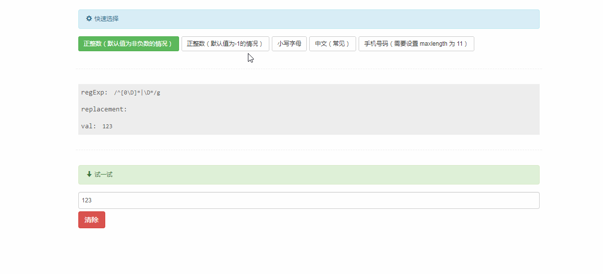

# ct-adc-pattern-input

基于 Vue2.0，使用正则限制用户输入的 input 组件，支持 v-model

## 目录

- [Demo build setup](#demo-build-setup)
- [在线 demo](#在线-demo)
- [项目结构](#项目结构)
- [参数说明](#参数说明)
- [示例](#示例)
- [想法](#thought)
- [License](#license)

## Demo build setup

``` bash
# install dependencies
npm install
or
cnpm install

# serve with hot reload at localhost:8080
npm run dev

# build for production with minification
npm run build

# build for production and view the bundle analyzer report
npm run build --report
```

For detailed explanation on how things work, checkout the [guide](http://vuejs-templates.github.io/webpack/) and [docs for vue-loader](http://vuejs.github.io/vue-loader).

## 在线 demo

点击: [Live Demo](http://htmlpreview.github.io/?https://github.com/ct-adc/ct-adc-pattern-input/blob/master/view/demo.html).



## 项目结构

```
ct-adc-pattern-input/
├── ...
├── src/
│   ├── /component
│   │   └── pattern-input.vue // 组件
│   └── /js
│      └── ... demo ...
└── /view
    └── demo.html
```

## 参数说明

参数|类型|默认值|是否必填|描述
--- | --- | --- | --- | --- |
regExp | RegExp | null | 否 | 用于 String.prototype.replace(regexp, replacement)
replacement | String | '' | 否 | 用于 String.prototype.replace(regexp, replacement)
val | String/Number | | 是 | v-model 的值


## 示例

#### Vue script

```javascript
setting: {
  regExp: /^[0\D]*|\D*/g, // 匹配不属于正整数的字符
  replacement: '',
  val: '223'
}
```

#### Vue template

```html
<pattern-input class="your-class-name"
               :regExp="setting.regExp"
               :replacement="setting.replacement"
               @input="handleInput"
               @change="handleChange"
               v-model.number="setting.val"></pattern-input>
```

> 这是一个只能输入正整数的配置，记得使用 v-molde.number

## 想法

I'm not sure is it necessary to emit all the input events. Now I only emit `input` and `change` events.

And I think the RegExp settings is not good enough, it's a bit awkward. Maybe I should match what I want instead of replacing what I don't want.

When I want to limit number range, it not convenient. In this condition, maybe create a number-input will be a good solution.


## License

Code released under the [MIT License](https://github.com/ct-adc/ct-adc-pattern-input/blob/master/LICENSE).
